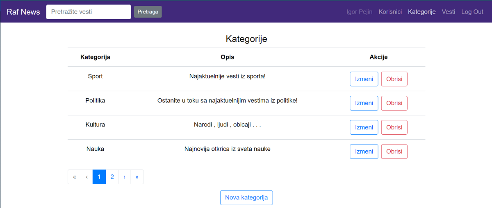
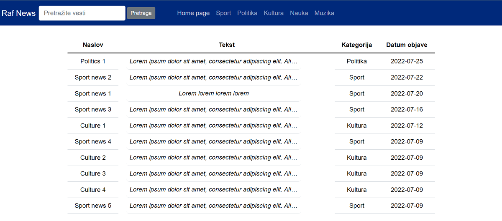
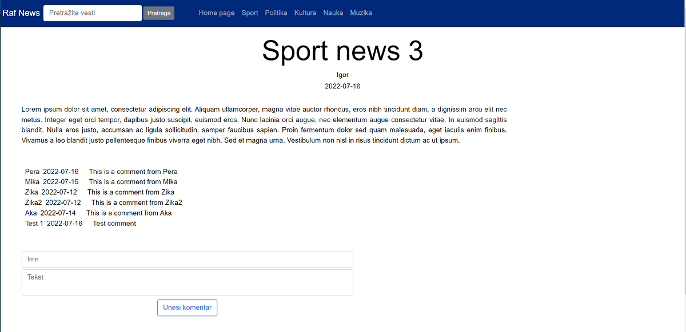

# Raf News Platform
Web application for reading and publishing news. There are three types of users: admin, content creator and regular user.
Content creators can create new categories and write news. Admins can also do all of that and manage users. Admin can change user info and deactivate their account.
Project consists of three modules : 
1. RafNews_back - backend of the project written in java (Jax - RS).
2. Raf news - cms, frontend for admins and content creators
3. raf_news_platformm - frontend of the project, done with Vue.js

- Users need to be authenticated if they want to access cms. Auth implemented using JWT.
- Every list and table is paginated so that one request to backend returns data for the page we are currently looking.
- Users can search news: search returns all news where the text in the search bar is present in title or the news text. 
- Database entities: category (kategorija), comment (komentar), user (korisnik), tag, news (vest), news_tag (vest_tag). News can have multiple tags and tag can be added to multiple news.  

# Home page for users where they can see latest news.

# News page

        
    
    

